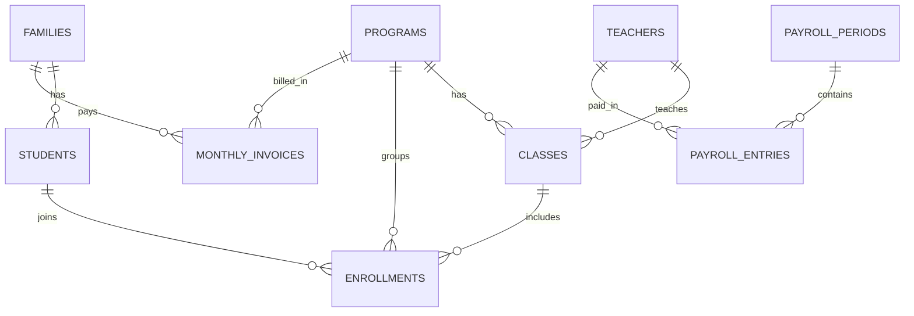

# Data Model

This project uses 9 Prisma models to represent school operations, tuition tracking, and payroll.

## ER Diagram

## Models

- `Programs` — School programs (for example Hifz or Weekend) used by classes, enrollments, and invoices.
- `Families` — Parent/family records with contact info and billing identity.
- `Students` — Children linked to a family with demographics and enrollment status.
- `Teachers` — Teacher records with contact info, hourly rate, and payout details.
- `Classes` — Class definitions by program/year/session, optionally assigned to a teacher.
- `Enrollments` — Join table mapping students into classes/programs with enrollment lifecycle status.
- `MonthlyInvoices` — Per family/program/month tuition and payment tracking including balances.
- `PayrollPeriods` — Payroll time windows (monthly periods) used to group teacher payouts.
- `PayrollEntries` — Per-teacher payroll lines inside a period with hours, computed pay, and payout status.
