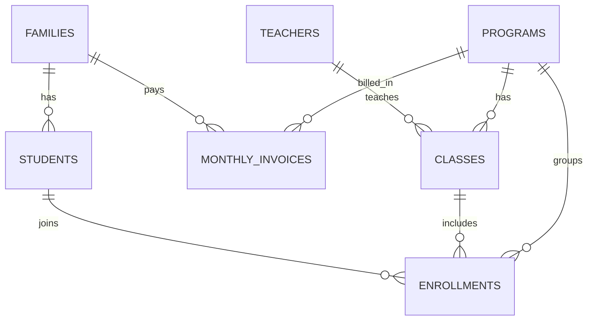

# Data Model

This project uses 7 Prisma models to represent school operations and tuition tracking.

## ER Diagram

## Models

- `Programs` — Fixed school programs (Hifz and Weekend) used by classes, enrollments, and invoices.
- `Families` — Parent/family records with contact info and billing identity.
- `Students` — Children linked to a family with demographics and enrollment status.
- `Teachers` — Teacher records with contact details and class assignments.
- `Classes` — Class definitions by program/year/session, optionally assigned to a teacher.
- `Enrollments` — Join table mapping students into classes/programs with enrollment lifecycle status.
- `MonthlyInvoices` — Per family/program/month tuition and payment tracking including balances.
