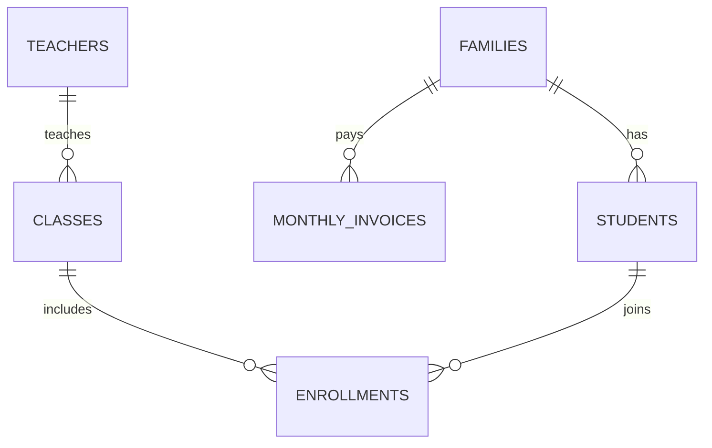

# Data Model

This project uses 6 Prisma models to represent school operations and tuition tracking.

## ER Diagram

## Models

- `Families` — Parent/family records with contact info and billing identity.
- `Students` — Children linked to a family with demographics and enrollment status.
- `Teachers` — Teacher records with contact details and class assignments.
- `Classes` — Class definitions with name, optional teacher assignment, and archive status.
- `Enrollments` — Join table mapping students into classes with enrollment lifecycle status.
- `MonthlyInvoices` — Per family/month tuition and payment tracking including balances and session.
